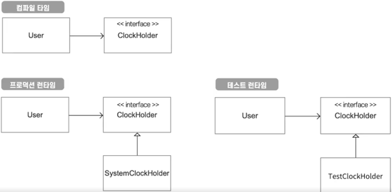
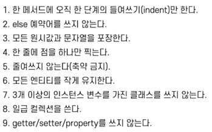

# Spring Wrong Note

### 컨벤션 교정
>축약어 
  - 대문자로 표현하지 않는다.
    - userId (Good)
    - userID (Bad)
    - OAuth 같은 애매한 축약어는 유명한 오픈소스 같은걸 참조하면 좋다 (스프링 시큐리티)
  - 왠만하면 축약보단 온전한 단어를 사용하는 것을 지향하자.
- 클래스 이름은 가급적 단어 조합은 3개 이하가 좋다.

>동사
  - 유의미한 단어를 사용하자
    - Simple, Light, Base, Util ... 등의 애매한 단어를 지양하자.
    - ~Creater, ~Factory ... 같이 구체적이고 목적에 맞는 이름을 사용하자.
    - ~Util 이란 이름은 사용할 경우 온갖 static 메소드들이 모인다.
  - get / find 를 구분하자.
    - Return T : Get
    - Return Optional T : Find
  - isExist (동사를 반복 = 없는 말) -> exist
  - get 을 남발하지 말자 (갖고있는 속성 정보를 제공하는 의미임)
    - 따라서 getSumPrice -> sumPrice
  - 검증이 필요할 때
    - verify / validate / check / is
    

> 롬복
  - 강력한 기능이긴 하지만 캡슐화를 망치는 주범이다.
  - getter, setter 를 남발하지 말자.
  - 객체를 수동적으로 만드는 건 좋지 않다.
    - 수동적 = 직접 데이터를 저장하고, 보여준다.
    - 능동적 = 객체에게 일을 시킨다. (TDA 원칙)

> 가독성
  - 주석은 필요할 때만 사용하자.
    - 유의미한 메소드 읽기좋은 코드를 만들자.
  - Optional을 자주 사용하자.
    - 코드의 완성도를 높이고 NPE를 방지한다.
  - Collection.Map을 남발하지 말자.
    - 활용도가 높아 분리하지 않고 주구장창 Map 만 쓰게 된다.
    - 즉, 본인만 이해할 수 있는 코드가 된다.
    - 사용할 경우 현재 Scope를 벗어나지 말자.

> 관습
  - 범위(range) : [start~, end~]
    - 시작은 포함, 끝은 미포함

> 자바진영 스타일 가이드 : **구글 코드 스타일 가이드 추천**
---

## SOLID
### Single Responsibility (단일 책임 원칙)
    - 어떤 클래스나 모듈은 변경하려는 이유를 단 한가지만 가져야 한다.
    - 코드라인이 100줄을 넘어간다면 의심해봐라
### Open-Close Principle (개방 폐쇠 원칙)
    - 확장엔 열려있고, 수정엔 닫혀있어야 한다.
    - 유연성, 재사용성, 유지보수성을 위한 원칙
    - 추상화(인터페이스화)가 부족한 경우 나타남
### Liskov Substitution (리스코프 치환 원칙)
    - 자료형 S가 자료형 T의 하위형이라면, 필요한 속성 변경없이 T의 객체를 S의 객체로 교체할 수 있어야 한다.
    - 상위클래스와 하위클래스 사이의 계약이 깨지는 경우
    - 상속은 신경쓸게 많고, 고비용이 들어가는 작업이라 가급적 피하는게 좋다.
### Interface Segregation (인터페이스 분리 원칙)
    - 자신이 사용하지 않는 메소드에 의존하지 않아야 한다.
    - 인터페이스를 분리/조립 하듯 만들이 않은 경우 발생
    - 인터페이스 : 이 기능을 사용하고 싶으면, 이 방법을 사용하세요~ 라고 알려주는 것 = public method
      - API도 인터페이스다.
### Dependency Inversion (의존성 역전 원칙)
    - 상위 모듈은 하위 모듈에 의존하면 안된다.
    - 상위 모듈과 하위 모듈 모두 추상화에 의존해야 한다.
    - 추상화는 세부사항에 의존하면 안된다. (반대여야 한다.)
    - 구현체에 바로 의존할 경우 문제 발생
    - 느슨한 결합도로 유연, 재사용성 및 코드의 단순화
    - 의존성 - 커플링, 다른 객체나 함수를 사용하는 상태
    - 의존성 주입 - 필요한 값을 외부에서 의존성을 넣어주는 것 (단, 의존성이 사라진게 아닌 약해진 것)
    - 의존성 역전 - 화살표 방향을 반대로 바꾸는 테크닉
    - 추상화는 좋은 방법론이지만 개발 비용을 증가시킨다. 
      - 추상화 여부는 개발자가 매번 판단해야 한다.
    - 생성자 주입이 7개, 파라미터 주입이 4개가 넘어간다면 클래스/메소드 분할을 고려하자.
  
### 의존성을 추상화 시키는 방법
    1. 의존성을 드러내라
      - 내부에 감춰진 의존성으로 인해 디버깅이 힘들다. 
      - 테스트하기에도 난해하다.
        - 테스트가 쉬운 코드는 좋은 코드.
        - 의존성을 제대로 처리하지 않으면 테스트하기 어렵다.
      - 시간, 랜덤값 같은 실행마다 변하는 값에 대한 의존성
    2. 변하는 값은 주입 받아라.
    3. 변하는 값을 추상화 시켜라.
       - 런타임과 컴파일타임의 의존성을 다르게 하는 것
       - ex. ClockHolder

### CQRS
    - Command and Query Responsibility Segregation
    - 명령과 질의의 책임 분리
      - 명령 : 일을 시키는 메소드 (객체 상태를 변경하며 반환값이 없다.)
      - 질의 : 상태를 물어보는 메소드 (객체 상태를 변경시키면 안되며, 값을 반환 한다.)
    - 메소드를 명령과 질의로 나누자 (더 넓게는 클래스 까지)

---

- 500 에러는 사실상 장애이기 때문에 반드시 원인을 파악하고 정리하자.
- 개발의 목적 : 좋은 프로그램
  - 돌아가야한다. (완벽한 설계, 테스트 커버리지 100% 이런걸 다 떠나 제대로 실행되어야 함)
  - 유지보수가 가능해야한다. (과한 스펙으로 인한 오버 엔지니어링도 피해야함)
- 디자인 패턴에 너무 매몰되면 안된다.
  - 디자인 패턴을 위한 시스템이 되선 안된다.
  - 요구사항을 고려하지 않고 패턴에만 집착하지 말자!
- OOP가 꼭 정답은 아니다. 절차지향도 나쁜건 아니다.
- OOP에서 제일 중요한 건 역할극이다. (역할, 책임, 협력)
- 객체지향 9가지 원칙 
- apache utils엔 좋은 라이브러리가 많고, 가독성이 올라간다.
  - StringUtils, ObjectUtils, CollectionUtils ...
- 라이브러리 사용 시 보안패치와 라이센스를 잘 확인해야한다.
- 상속을 지양하고, 컴포지션을 활용하자.
  - 컴포지션 : 공통 기능을 별도의 컴포넌트로 분리하고, 그 컴포넌트를 멤버변수로 가지는 것
- 코드를 짤 때 테스트를 생각하자. (테스트하기 쉬운 코드가 좋은 코드이다.)
- 개행 또는 들여쓰기가 많이 생긴다면 메소드 분할을 고려하자.
- 객체 지향 프로그래밍이지 클래스 지향 프로그래밍이 아니다.

---

## 스프링에서 OOP와 안티 패턴

### Smart UI
    - 스마트 컨트롤러를 피하자
        - 백엔드에서 UI = Controller
        - 핸들러에서 모든 코드를 처리하는 것을 의미하는 비꼬는 말
        - 컨트롤러는 어떤 서비스를 실행할지 선택하면 된다.
    - Relaxed layered system
        - 한 계층의 구성요소가 바로 아래있는 계층만이 아닌 하위 모든 계층에 접근을 허용하는 것
        - 스마트 컨트롤러를 유도하는 안티패턴이다.
    - DDD 에선 도메인 레이어가 따로 존재하는데 애플리케이션 핵심의 레이어이다.
    - 서비스 계층은 최대한 얇게 유지되어야 한다.
        - 오직 작업을 조정하고 도메인 객체의 협력자에게 작업을 위임한다.

### Transaction script
    - 서비스 코드가 트래잭션을 실행하는 스크립트 역할을 하는 것
    - 온갖 비즈니스 로직을 서비스가 가지고 있다 (서비스가 그냥 신적인 존재)
    - 절차지향적이다.

    - 그럼 어떻게 해결할까?
        - 애플리케이션 서비스는 비즈니스 결정을 내리면 안된다.
            - 도메인에게 위임해야한다.
        - 반드시 비즈니스 로직을 도메인이 들고있도록 하자.
        - 어느 객체에도 들어가기 애매한 객체는?
            - 새로운 도메인 객체를 만들면 그만이다.
            - 이런 객체는 도메인 레이어에 해당하는 도메인 서비스 객체이다.
            - 이 때 서비스가 아닌 어떤 유의미한 도메인이 될 수 있는지 확인해야한다.
    => 훨씬 능동적이고 협력하는 설계를 만들 수 있다.

- DDD (도메인을 이상적으로 다루는 방법론)
- EDD (결합을 끊는 좋은 방법론)

---