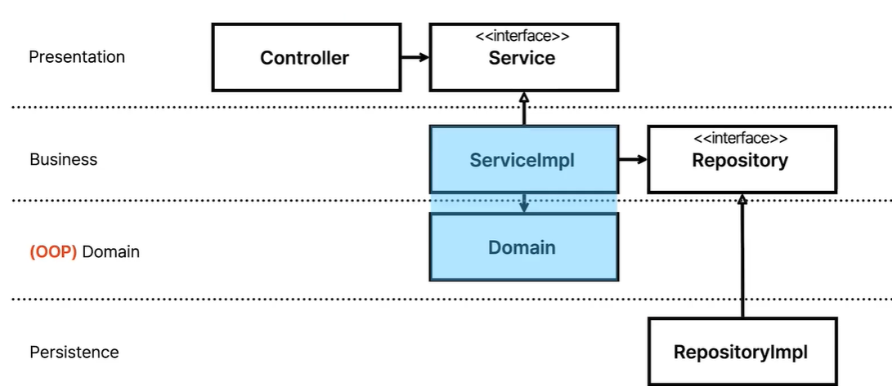
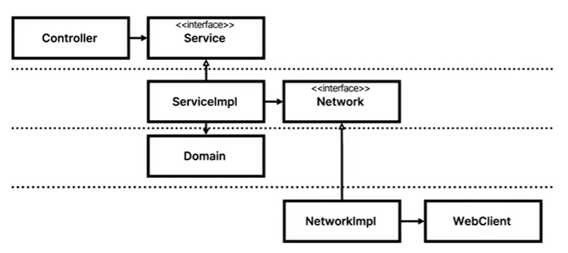
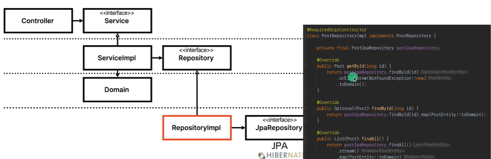

### 모든 테스트가 H2를 필요로 한다 -> 모든 테스트가 중형 테스트이다.
### 레이어드 아키텍처의 문제점
- 데이터베이스 주도 설계를 유도한다. (모든 것이 영속성 계층을 토대로 만들어진다.)
    - JPA 엔티티를 먼저 떠올리는 것
    - 필요한 Use case를 파악하는 것과 도메인 간의 관계를 생각하는 것이 먼저이다.
- 동시 작업이 어렵다.
- 절차 지향적인 사고를 유도한다.
   - 서비스가 신과 같은 존재이다.
- 업무 도메인에 대해 파악하기 어렵다. (죽은 도메인)
- 한번 테스트 돌리는데 오래걸려 부담이 된다.
- 설계가 잘못되었을 확률이 크다.
   - 데이터베이스와 강결합되어 있고, H2, Mockito 없이는 테스트가 불가능한 시스템이다.
- 지금 작성한 테스트가 실제로 필요한 본질이 아닐 확률이 있다.
- 똑같은 기능을 테스트한다 해도 어떻게 테스트하냐에 따라 테스트의 크기가 결정된다.
    - 중형 테스트인줄 알았는데 소형 테스트로 변할 수 있다.

### 개선
- 도메인 영역을 만든다.
    - 계층간 연결된 의존성이 없다.
        - Mocking을 할 필요가 없어진다.
    - 순수 자바코드 자체이기 때문에 인스턴스로 만들기 쉽다.
        - Testability가 높다.
- Service <-> Repository 와의 의존성을 해결
    - 인터페이스와 구현체 관계로 처리한다.
    - Fake객체 활용이 가능해진다.
- 인터페이스와 구현체 관계를 통해 다른 레이어와 외부 연동과의 의존성을 쉽게 개선할 수 있다.
    - 의존성 역전 원칙
        - 의존관계 약화 -> 독립 -> 테스트 가능성 UP
    

### 낮은 커버리지
- JPA와 Spring, Controller쪽 테스트를 안하면 커버리지가 낮게 나온다?
    - 도메인이 그만큼 빈약하다!
        - 서비스의 경쟁력을 의심해봐야 한다.
    
### 추가사항
- 패키지/클래스 간 순환 참조 주의
- domain/layer 구조의 패키지
    - 직관적이다.
    - MSA 확장 가능
- Jpa 엔티티와 도메인 모델 분리
- Setter 지양
- CQRS